# Real Estate Analytics Dashboard

An interactive dashboard powered by AI agents for analyzing real estate market data. This tool allows users to explore real estate metrics through natural language queries, creating custom visualizations and providing insightful analysis.

## System Architecture

The system uses three AI agents working together to process natural language queries and generate insights:

```mermaid
flowchart TD
    subgraph User["User Input"]
        Query["'Show me Boston home prices'"]
    end

    subgraph Agents["    AI Agents"]
        Agent1["🎨 Visualization Agent
        Creates Python code for the visualization"]
        Agent2["🔍 Code Verification Agent
        Checks and runs the code safely"]
        Agent3["📊 Explanation Agent
        Explains insights in business terms"]
    end

    subgraph Output["Dashboard Output"]
        Chart["Interactive Chart"]
        Text["Business Insights"]
    end

    Query -..-> Agent1
    Agent1 --> Agent2
    Agent2 --> Agent3
    Agent2 --> Chart
    Agent3 --> Text

    classDef queryClass fill:#e6f3ff,stroke:#333,stroke-width:2px
    classDef agentClass fill:#fff7e6,stroke:#333,stroke-width:2px
    classDef outputClass fill:#e6ffe6,stroke:#333,stroke-width:2px
    
    class Query queryClass
    class Agent1,Agent2,Agent3 agentClass
    class Chart,Text outputClass
```



## Features

- **Natural Language Interface**: Ask questions about real estate data in plain English
- **Interactive Map**: Explore geographic data visualization
- **Custom Visualizations**: Generate tailored charts and graphs
- **Automated Analysis**: Get AI-powered insights and explanations
- **Historical Data**: Access and analyze historical real estate trends
- **Safe Code Execution**: Secure handling of generated visualization code

## Installation

1. Clone the repository:
```bash
git clone https://github.com/yourusername/real-estate-analytics.git
cd real-estate-analytics
```

2. Create and activate a virtual environment:
```bash
python -m venv venv
source venv/bin/activate  # On Windows: .\venv\Scripts\activate
```

3. Install dependencies:
```bash
pip install -r requirements.txt
```

4. Set up environment variables:
```bash
cp .env.example .env
# Edit .env with your OpenAI API key and other settings
```

## Usage

1. Start the dashboard:
```bash
python src/app.py
```

2. Open your browser and navigate to:
```
http://localhost:8050
```

3. Enter your query in the "Ask AI" tab to generate visualizations

## Example Queries

- "Show me the hottest real estate markets right now"
- "Compare home prices in Boston over the last 5 years"
- "Which cities have the highest price growth rate?"
- "Forecast housing prices in San Francisco"
- "Show inventory levels across major cities"

## Data Sources

The dashboard uses Zillow's real estate data, including:
- Home Values
- Inventory Levels
- Price Changes
- Market Temperature Index
- Days on Market
- Sales Volume

## Requirements

- Python 3.8+
- OpenAI API key
- Dependencies listed in requirements.txt

## License

MIT License - see LICENSE file for details

## Contributing

1. Fork the repository
2. Create your feature branch (`git checkout -b feature/AmazingFeature`)
3. Commit your changes (`git commit -m 'Add some AmazingFeature'`)
4. Push to the branch (`git push origin feature/AmazingFeature`)
5. Open a Pull Request

## Support

For support, please open an issue in the GitHub repository.